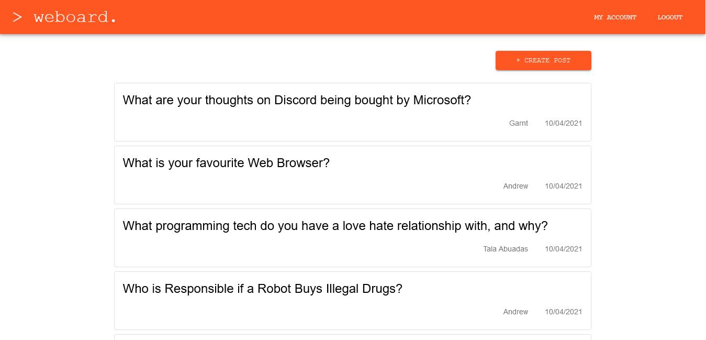

# System Design and Implementation

## 2.1 Client side component and UI

We used React.js to design the frontend

{width=600px} 

## 2.2 Server side CGI components

The backend serves to control the interaction the user has with the data in the database.
The backend authenticates and authorizes users to make sure they are logged in when accessing the site.
The backend also takes requests for posts and serves them to the front-end.

## 2.3 Database Tier design, data, usage

We used MongoDB for the database. We have 2 tables
In one of the tables we store the users' information. This table contains the user's name, their email, their id, an array of their posts, their hashed password and the salt that was used to generate that password. We use this table to authenticate the users when they try to login and to list the posts that a user has created.
In another table we store the posts. This table contains the post's id, the title, body paragraph, timestamp, its author's name, its author's object from the first table and an array of comments. This array of comments also contains its timestamp, body paragraph, and the author's name and author object. We use this table to store user posts and the comments on this post and to retrieve them to display to the user.

## 2.4 New Features and Tools

We used the MERN Stack to make this application. 

## 2.5 Problem Solving Algorithms

To implement our vision, we used an MVC model to streamline development. By separating the tables, we optimized the code to serve the users the exact information they need. This alleviates the need to load an extremely large amount of data that would cause a bottleneck in effectively serving the users.

## 2.6 Efficiency and Robustness

The website is very fast and responsive. Users can create and retrieve many posts nearly instantaneously. Even when waiting to load data, the website is very responsive to user input.

