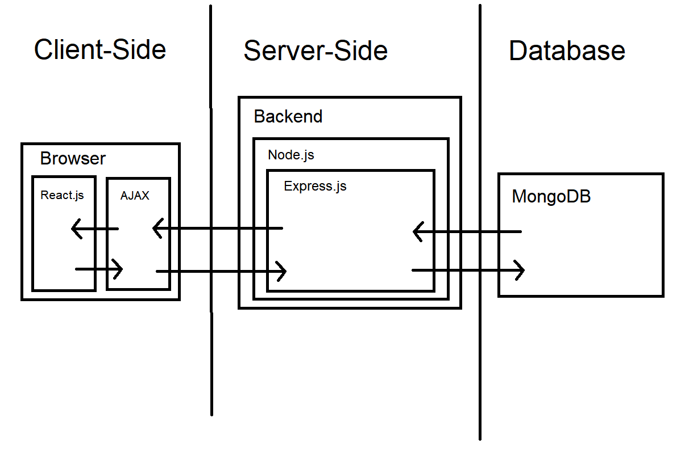

# CP476 Project: Internet Discussion Board

Mandeep Sran, Min-Ho Choi, Tala Abua

2021-03-22

## 1. Introduction

The Internet Discussion Board (called IDB from here on out) is a web application written in ReactJS, NodeJS, ExpressJS and MongoDB providing users an opportunity to interact with one another. The app aims to provide anyone who be re-used and setup with their own database/server to host and create their own discussion board as a general all-in-one use template. Simple, lightweight, yet nice to look at is the aim of the final product.

## 2. Problem Solving and Algorithms

The IDB will be broken up into problems categorized under Database, Backend Architechture and Design.

Database: Storing users, storing posts of users, relationally storing which post has which subcomments, user data.

Backend Architechture: REST endpoints and organization of CRUD operations, how to move around our data for each user efficiently without loading everything, deploying backend.

Design: A clean and simple design for any devices which also looks pleasing.

## 3. System Design

As stated above, we will be using React.js for the front-end with AJAX for communicating with the backend, Node.js with the Express.js web framework as our backend server and MongoDB for our database. The following picture describes how these components will be interacting with each other.

## 4. Milestones & Schedule

| Task ID | Description                                                      | Due Date   | Lead     |
| ------- | ---------------------------------------------------------------- | ---------- | -------- |
| 1       | Design front end in React for all posts and individual posts     | March 26th | Mandeep  |
| 2       | Create database schemas for users, posts, setup relations        | March 26th | Tala     |
| 3       | Create backend API for posts and users to consume with endpoints | March 26th | Min-Ho   |
| 4       | Combine all 3 parts to get working prototype                     | March 29th | Mandeep  |
| 5       | Bug-check and add any additional features and QA test            | March 30th | Everyone |

## 5. References
